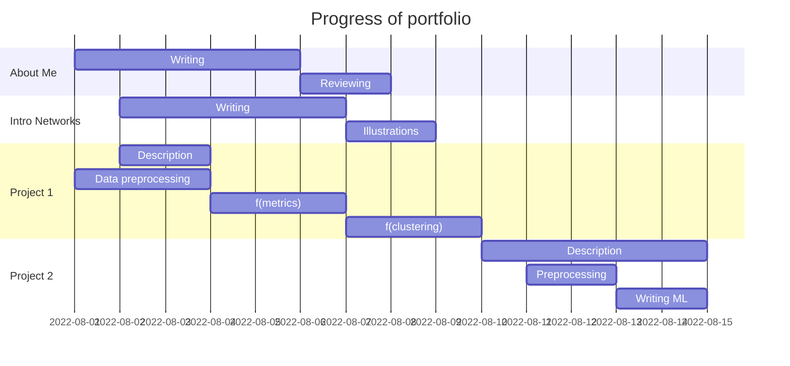

## ABOUT ME AND THIS PORTFOLIO
I am Dr. Pierre Olivier, a Data Scientist and biological oceanographer. My academic career has primarily focused on identifying, tracking, and forecasting patterns in the data, and more specifically, changes in marine food webs.

- [ ] If you are more interested in the data science part, you can skip to the first project,
- [ ] But if you don't know yet what are food webs and would like a short introduction, [tag along](https://pierreenolivier.github.io/datascience_portfolio/).

You can access my research publications on my [**Google Scholar page**](https://scholar.google.fr/citations?user=QaG46p0AAAAJ&hl=en).

### A couple of useful links
- [ ] [**Google Scholar**](https://scholar.google.fr/citations?user=QaG46p0AAAAJ&hl=en)
- [ ] [**LinkedIn**](https://www.linkedin.com/in/pierre-olivier-phd-data-1485598b/)
- [ ] [**Twitter**](https://twitter.com/PierreENOlivier)  

## Progress portfolio

## File structure
{width=900px}