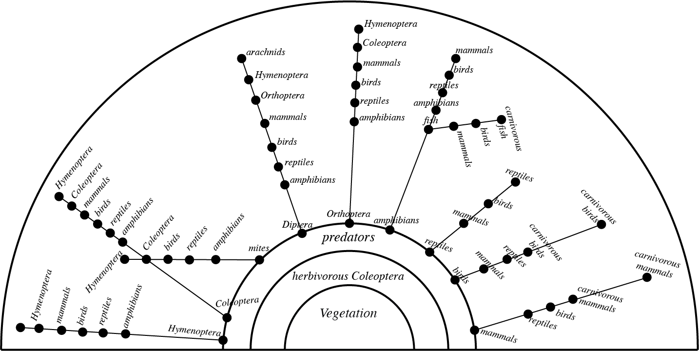

# Introduction to networks and food webs

You might remember from high school hearing about the food chain: that herbivores eat
plants, carnivores eat those herbivores, and so on in a successive chain of food relationships.

The food web is an extension of this concept. Because there exists many species of plants, herbivores, and carnivores in an ecosystem, there exists many interconnected food chains. The food web represent those interconnected food chains at the scale of an ecosystem and it can be mapped as a network of interactions between species.

Ecological networks such as 

{width=300px align=center}

## What are networks
Some text for the food web intro page

